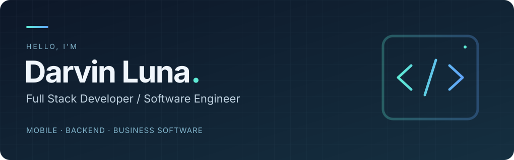
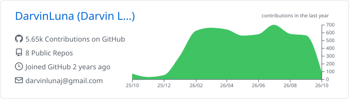
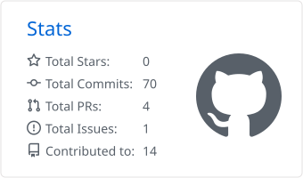
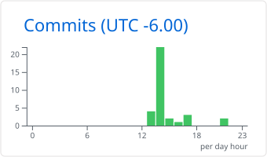
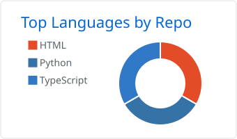
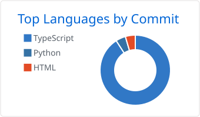

  

  
<strong>Full Stack Developer · Software Engineer</strong> 
  Mobile apps · Web platforms · Backend services · Enterprise software

  

    
    
  

  
<em>Open to Full Stack Developer and Software Engineer opportunities</em>

## About me

I'm Darvin Luna, a Full Stack Developer and Software Engineer building mobile, web, backend, and enterprise software. I turn product and business needs into reliable applications, APIs, and workflow solutions.

- 📱 Develop mobile and web experiences with React Native, React, and Next.js.
- ⚙️ Build backend services and APIs with Python, Django, and Node.js.
- 🧩 Deliver business software and automation with Odoo, UiPath, and Docker.

## Technology stack

### Languages

  
  
  

### Mobile & Frontend

  
  
  

### Backend & Data

  
  
  
  

### Enterprise & DevOps

  
  
  

## GitHub activity

  <picture>
    <source media="(prefers-color-scheme: dark)" srcset="./profile-summary-card-output/github_dark/0-profile-details.svg">
    <source media="(prefers-color-scheme: light)" srcset="./profile-summary-card-output/github/0-profile-details.svg">
    
  </picture>

  

  <picture>
    <source media="(prefers-color-scheme: dark)" srcset="./profile-summary-card-output/github_dark/3-stats.svg">
    <source media="(prefers-color-scheme: light)" srcset="./profile-summary-card-output/github/3-stats.svg">
    
  </picture>
  <picture>
    <source media="(prefers-color-scheme: dark)" srcset="./profile-summary-card-output/github_dark/4-productive-time.svg">
    <source media="(prefers-color-scheme: light)" srcset="./profile-summary-card-output/github/4-productive-time.svg">
    
  </picture>
  

### Languages across my repositories

  <picture>
    <source media="(prefers-color-scheme: dark)" srcset="./profile-summary-card-output/github_dark/1-repos-per-language.svg">
    <source media="(prefers-color-scheme: light)" srcset="./profile-summary-card-output/github/1-repos-per-language.svg">
    
  </picture>
  <picture>
    <source media="(prefers-color-scheme: dark)" srcset="./profile-summary-card-output/github_dark/2-most-commit-language.svg">
    <source media="(prefers-color-scheme: light)" srcset="./profile-summary-card-output/github/2-most-commit-language.svg">
    
  </picture>

## Contribution trail

  <picture>
    <source media="(prefers-color-scheme: dark)" srcset="https://raw.githubusercontent.com/DarvinLuna/DarvinLuna/output/github-snake-dark.svg">
    <source media="(prefers-color-scheme: light)" srcset="https://raw.githubusercontent.com/DarvinLuna/DarvinLuna/output/github-snake.svg">
    
  </picture>

